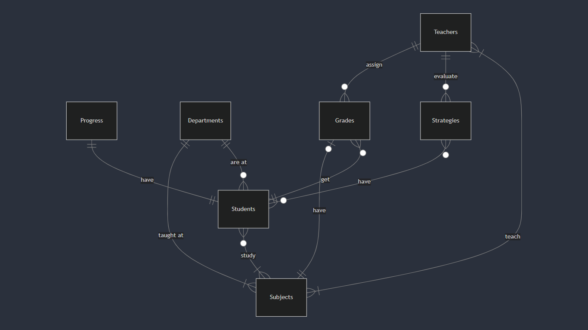

# Design Document

By Carlos Nieves

Video overview: <https://youtu.be/4NxzqdqWgdg)>

## Scope

The purpose of my database is to store all the information required by an educational institution, more specifically a university. This includes protecting sensitive data—personal information such as first and last names, phone numbers, emails, and passwords—optimizing access to relevant data such as grades, GPAs, and classrooms; streamlining processes inherent to an educational institution (such as grade uploads and registration)—and providing a pleasant and optimal experience for both teachers and students.

During the design process, I tried to cover most of the essential aspects for a system (in this field) to be truly useful. This database includes: the teachers, what and who they teach, their assessment strategies and corresponding grades, the students, the subjects they take and the progress they make in their programs, the existing departments (medicine, engineering, dentistry, etc.), and the curriculum established by each department.

Details that have been left out of the scope of my design could be the following: the different sections that a specific subject can have (e.g. this semester, the subject "fundamentals of algorithms" has a total of 3 sections, each with a maximum of 45 students), and the period of the year (quarter, semester) where a certain number of subjects were taught in a faculty.

## Functional Requirements

My two main target users are teachers and students. Different interfaces have been designed with specific functions for each. Therefore,

- *a teacher* will be able to view the subjects they will teach, their assigned section, and the number of students enrolled in that area; as well as organize and manage the assessment strategies they will design for their students: their type, the content to be assessed, the percentage, the scheduled date, and access to an automatic list of students who will take the assessment plan so that, as it is implemented, all grades are archived and organized. Additionally, they will be able to assign the final grade to their group of students in a practical way.

- *a student* will be able to enroll in the courses assigned to them according to their department and the current semester. They will be able to view the final grades for each of the enrolled courses, as well as information about them: their section, the name of the teacher, and the number of credit units for each course.

## Representation

### Entities

* What entities will you choose to represent in your database?
    Students, professors, grades, subjects, departments, student progress, and the assessment strategies used by professors.

* What attributes will these entities have?
    - Students: their IDs, first and last names, email, phone number, password, and the department they belong to at the university.
    - Professors: their IDs, first and last names, email, phone number, and password.
    - Grades: unique ID code, student ID, professor ID, subject ID, range (0-10), date.
    - Subjects: unique ID code, name, department where the course is taught, semester it belongs to in the curriculum, credit units awarded upon passing.
    - Departments: unique ID code, name of the university area/campus.
    - Student Progress: student ID, current semester, credit units earned.
    - Assessment strategies: unique identification code, assessment type, topic to be assessed, final grade percentage, instructor ID, subject ID, date.

* Why did you choose the types you chose?
    To reliably and optimally represent each of the attributes possessed by all the entities collected in my design. After an extensive process of analysis, questioning, and research, each of the data types chosen will ensure proper storage and allow this large amount of data to be transformed into strategic and valuable information for those who require it.

* Why did you choose the restrictions you chose?
    To ensure the integrity of each of the stored data. Based on the careful design implemented, each of the attributes of the entities involved has a meaning and purpose that is part of a much larger "whole." Therefore, based on that foundation, it is essential to apply the restrictions meticulously to safeguard the condition and meaning of this dataset.

### Relationships

First, one of the most important entities is "students," with the following relationships:
    - *Subjects (many-to-many):* A student must take at least one subject while enrolled at the university. A subject can be taken by zero or many students.
    - *Progression (one-to-one):* A student has at most one progress (the semester they are in and the credit units earned). A progress contains information on only one student.
    - *Departments (many-to-one):* A student can be studying a degree in at most one department/faculty. A department houses many students, and it could also have none.
    - *Grades (one-to-many):* A student can earn many grades throughout their degree, but at the beginning, none. However, a grade is earned by only one student, no more.
    - *Strategies (many-to-many):* A student must present many assessment strategies throughout their academic training, but at first, they may not present any. While assessment strategies will be taken by many students, in some cases, none will present them.

Regarding "teachers," they are related to:
    - *Grades (one-to-many):* A teacher can assign many grades to many students. While a grade is assigned exclusively by a single teacher.
    - *Strategies (one-to-many):* A teacher can employ many strategies to assess their students. While an assessment strategy is assessed by only one teacher.
    - *Subjects (many-to-many):* A teacher can teach at least one subject, perhaps several, just as a subject can be taught by at least one teacher, possibly several.

"Subjects" have two crucial relationships:
    - *Departments (many-to-one):* A subject must be taught in the department to which it corresponds, depending on the area of ​​study. While a department has a selected set of many subjects.
    - *Grades (one-to-one):* A subject must have a grade at the end of a given academic period, but for a considerable period it does not. A grade belongs exclusively to a single subject.

## Optimizations

* Which optimizations (e.g., indexes, views) did you create? Why?
    - A "subjects_index" index was implemented to optimize some of the most common queries that required extracting information from the "subjects" table. This table is more for backup purposes and is not modified very often, which is why this index was implemented.
    - A "logic_math" view was also created to facilitate querying information when requesting the list of students enrolled in a particular course.

## Limitations

* What are the limitations of your design?
    Although my design aims to offer a solution that can be used by a specific academic institution in general, I feel that one of the limitations that could arise would be the inability to handle multiple sections for each subject taught in a specific department.

* What might your database not be able to represent very well?
    I believe there could be a disadvantageous gap when representing the different sections established in a specific subject.